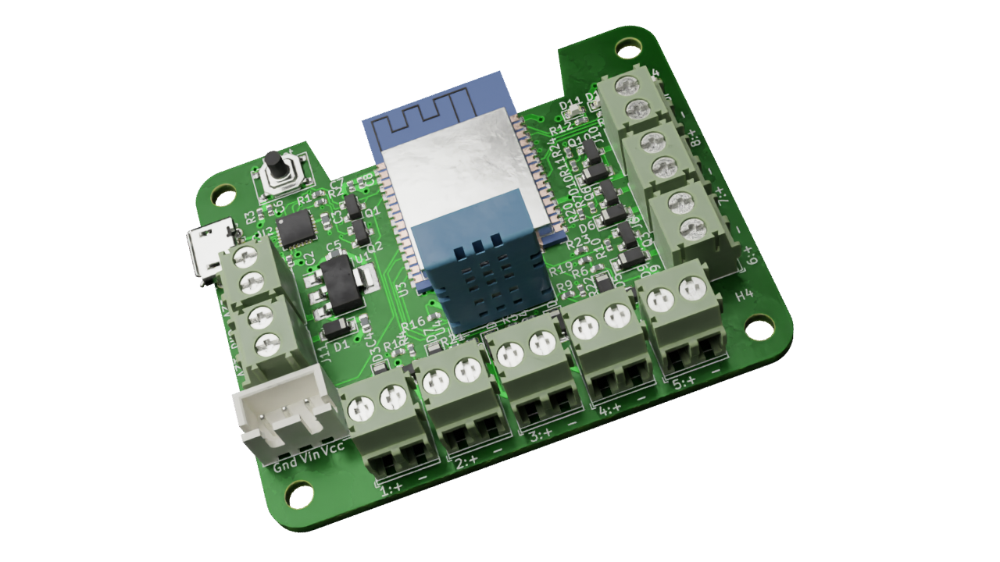

# KiBot example of how to cache 3D models

The KiBot docker iamges doesn't contain KiCad's 3D models.
This is because they take a huge ammout of resources.

KiBot will try to download any model which name starts with
`${KISYS3DMOD}/` or `${KICAD6_3DMODEL_DIR}/` from the KiCad repo.

The drawback is that you have to download them for each run.
But GitHub has a cache mechanism. This example shows how to use GitHub's cache
to avoid downloading the models on each CI/CD run.

For our example we'll use the following board:

In this example all but two 3D models come from the KiCad lib.

